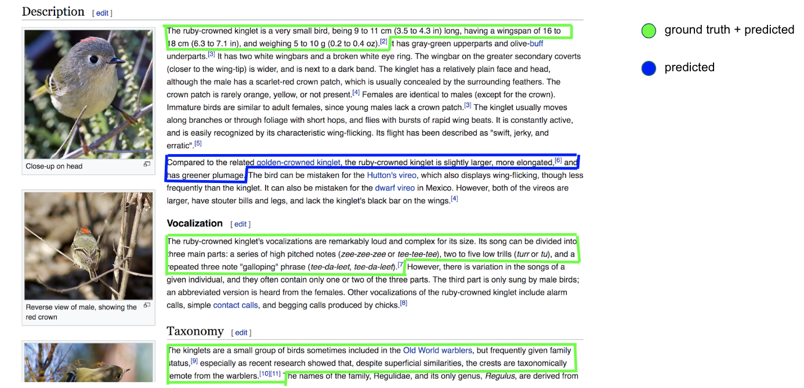

# SliceCast
A recurrent neural architecture for long-document segmentation

# Demo / TLDR

# Table of Contents
[**Demo**](#Demo-/-TLDR)
[**Data**](#Data)
  * [**Wiki-727k Dataset**](#Wiki-727k)
  * [**Small-scale podcast dataset**](#Small-scale-podcast-dataset)

[**Results**](#Results)
  * [**Reproducing Results**](#Reproducing-results)

[**Built With**](#Built-With)

[**Authors**](#Authors)

[**License**](#License)

[**Acknowledgments**](#Acknowledgments)


# Data
The data for this project comes from two separate sources:

## Wiki-727k
Data Structure:
* train set: 582160 text files
* test set: 73232 text files
* dev set: 72354 text files

## Small-scale podcast dataset

# Results

## Reproducing Results

Following these instructions will get you a copy of the project up and running on your local machine for development
and testing purposes.

### Prerequisites

Running the code in this repository requires elementary knowledge of both Jupyter and Anaconda. It is recommended that 
new users create a new virtual environment with Anaconda to ensure that package dependencies match the developer 
versions. If you are unfamiliar with Anaconda, you can find more information and getting started tutorials here:
https://conda.io/docs/user-guide/overview.html

Note that python version 3.6.7 was used for this project. To create a new Anaconda environment, you may use the terminal
command:
```
conda create -n name_of_myenv python=3.6.7
```
After creating this environment, you may clone this repository to your local machine. Within the top level directory,
you will find a 'req.txt' file, which includes a comprehensive list of dependencies necessary to execute the
functionality
of this repository. With your new environment active, use the following command to install these dependencies:
```
pip3 install -r /path/to/req.txt
pip3 install git+https://github.com/boudinfl/pke.git
python3 -m spacy download en
navigate to data directory
tar -xvf wiki-sample.tar.gz
```

# Built With
* [TensorFlow](https://www.tensorflow.org) - The Neural Network backend used
* [Keras](https://keras.io) - The Neural Network high-level API
* [NumPy](http://www.numpy.org/) - Matrix operations and linear algebra

# Authors

* **Brian Midei** - [bmmidei](https://github.com/bmmidei)
* **Marko Mandic** - [markomandic](https://github.com/markomandic)

# License

This project is licensed under the MIT License - see the [LICENSE](LICENSE) file for details

# Acknowledgments

* Omri Koshorek, Adir Cohen, Noam Mor, Michael Rotman, Jonathan Berant for proposing text segmentation as a supervised
learning task and for providing the Wiki-727k dataset
    * Link to original paper - https://arxiv.org/abs/1803.09337
